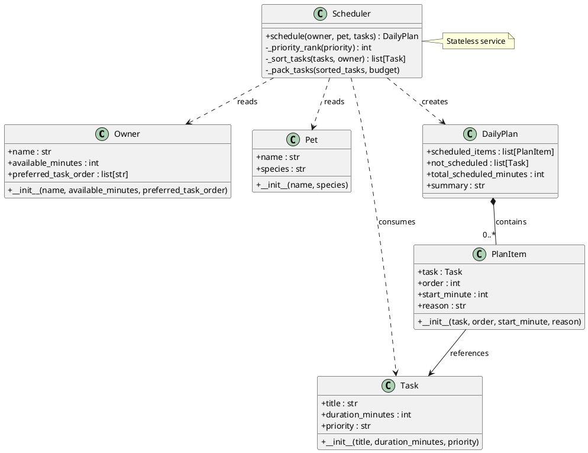
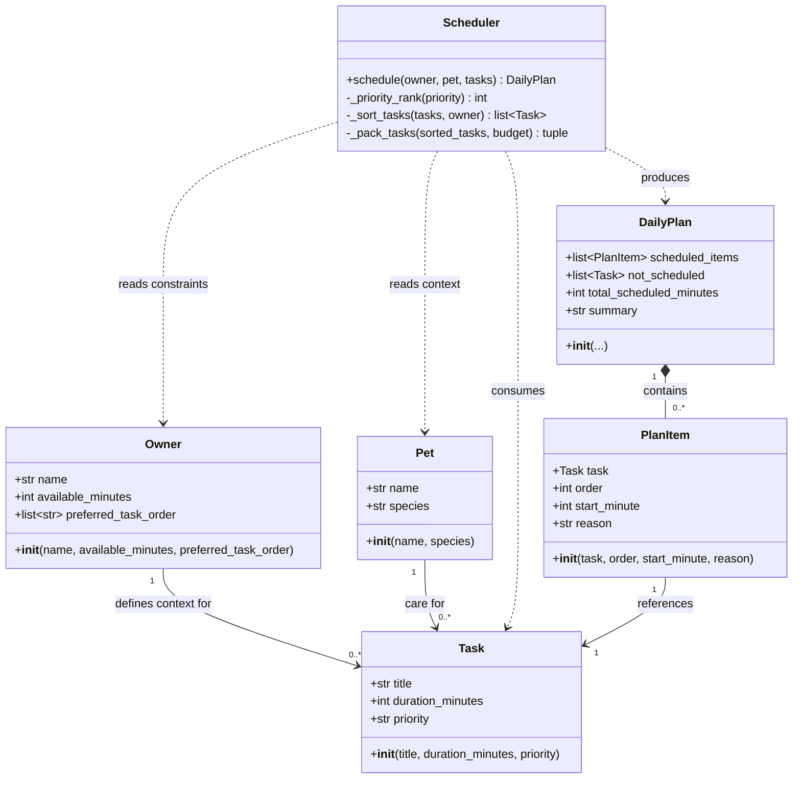

# PawPal+ — UML design (draft)

This document describes the initial object model for the pet care planning assistant. It is a **draft**; refine it as implementation reveals gaps.

## Text UML — class boxes (ASCII)

Plain-text class notation: `+` public, `-` private; underlines separate attributes from methods.

```
┌──────────────────────────────────────────────────────────┐
│                         Owner                            │
├──────────────────────────────────────────────────────────┤
│ ATTRIBUTES                                               │
│ + name: str                                              │
│ + available_minutes: int                                 │
│ + preferred_task_order: list[str]                        │
├──────────────────────────────────────────────────────────┤
│ METHODS                                                  │
│ + __init__(name, available_minutes, preferred_task_order)  │
└──────────────────────────────────────────────────────────┘

┌──────────────────────────────────────────────────────────┐
│                          Pet                             │
├──────────────────────────────────────────────────────────┤
│ ATTRIBUTES                                               │
│ + name: str                                              │
│ + species: str                                           │
├──────────────────────────────────────────────────────────┤
│ METHODS                                                  │
│ + __init__(name, species)                                │
└──────────────────────────────────────────────────────────┘

┌──────────────────────────────────────────────────────────┐
│                         Task                             │
├──────────────────────────────────────────────────────────┤
│ ATTRIBUTES                                               │
│ + title: str                                             │
│ + duration_minutes: int                                  │
│ + priority: str   # "low" | "medium" | "high"            │
├──────────────────────────────────────────────────────────┤
│ METHODS                                                  │
│ + __init__(title, duration_minutes, priority)            │
└──────────────────────────────────────────────────────────┘

┌──────────────────────────────────────────────────────────┐
│                       PlanItem                           │
├──────────────────────────────────────────────────────────┤
│ ATTRIBUTES                                               │
│ + task: Task                                             │
│ + order: int                                             │
│ + start_minute: int                                      │
│ + reason: str                                            │
├──────────────────────────────────────────────────────────┤
│ METHODS                                                  │
│ + __init__(task, order, start_minute, reason)            │
└──────────────────────────────────────────────────────────┘

┌──────────────────────────────────────────────────────────┐
│                       DailyPlan                          │
├──────────────────────────────────────────────────────────┤
│ ATTRIBUTES                                               │
│ + scheduled_items: list[PlanItem]                        │
│ + not_scheduled: list[Task]                              │
│ + total_scheduled_minutes: int                           │
│ + summary: str                                           │
├──────────────────────────────────────────────────────────┤
│ METHODS                                                  │
│ + __init__(...)                                          │
└──────────────────────────────────────────────────────────┘

┌──────────────────────────────────────────────────────────┐
│                       <<service>>                        │
│                       Scheduler                          │
├──────────────────────────────────────────────────────────┤
│ METHODS                                                  │
│ + schedule(owner: Owner, pet: Pet, tasks: list[Task])    │
│       -> DailyPlan                                       │
│ - _priority_rank(priority: str) -> int                   │
│ - _sort_tasks(tasks, owner) -> list[Task]                │
│ - _pack_tasks(sorted_tasks, budget) -> tuple             │
└──────────────────────────────────────────────────────────┘
```

## Text UML — relationships (ASCII)

```
     ┌────────┐                          ┌─────────────┐
     │  Pet   │                          │   Owner     │
     └───┬────┘                          └──────┬──────┘
         │                                      │
         │ context                               │ constraints,
         │                                       │ preferences
         ▼                                      ▼
     ┌───────────────────────────────────────────────────┐
     │  Task  (many instances per planning session)      │
     └───────────────────────┬───────────────────────────┘
                             │ input
                             ▼
                    ┌────────────────┐
                    │   Scheduler    │
                    │  .schedule()   │
                    └────────┬───────┘
                             │ produces
                             ▼
                    ┌────────────────┐
                    │   DailyPlan    │─────── composition ──▶ PlanItem * 
                    └────────────────┘             each PlanItem ──▶ Task
```

## PlantUML (text format)

Paste into a [PlantUML](https://plantuml.com/) renderer or VS Code extension if you prefer editable text diagrams.



## Class diagram (Mermaid)



## Responsibilities

| Class | Role |
|-------|------|
| **Owner** | Holds who is planning and **hard constraints** for the day (notably time available). Optional **preferences** (e.g. preferred task order for ties) influence ordering when priorities or durations are equal. |
| **Pet** | Identity and species for display and for future rules (e.g. species-specific defaults). The starter UI already collects this. |
| **Task** | One care item: what it is, how long it takes, and priority (`low` / `medium` / `high` to match the Streamlit form). |
| **PlanItem** | One line in the final schedule: which task, sequence position, when it starts (minutes from “start of day”), and a **human-readable reason** for the reflection/demo requirement. |
| **DailyPlan** | The full output: ordered `PlanItem`s, any tasks that **did not fit** the time budget, total minutes used, and an optional short summary. |
| **Scheduler** | Stateless service: `schedule(owner, pet, tasks)` builds a `DailyPlan`. Internally it may rank by priority, break ties with owner preferences, then **greedily** pack tasks until `available_minutes` is exhausted (concrete algorithm TBD). |

## Notes

- **Streamlit mapping:** Form fields map directly: owner name → `Owner.name` (plus a new numeric input or default for `available_minutes`); pet name and species → `Pet`; session task dicts → `Task` instances.
- **Extensibility:** Additional fields (e.g. `Task.category`, `Owner.strict_windows`) can be added without changing the high-level flow: scheduler reads constraints, outputs `DailyPlan`.
- **Next step:** Add Python stubs (`owner.py`, `pet.py`, `task.py`, `plan.py`, `scheduler.py`) with these methods and attributes, then implement `Scheduler.schedule`.
